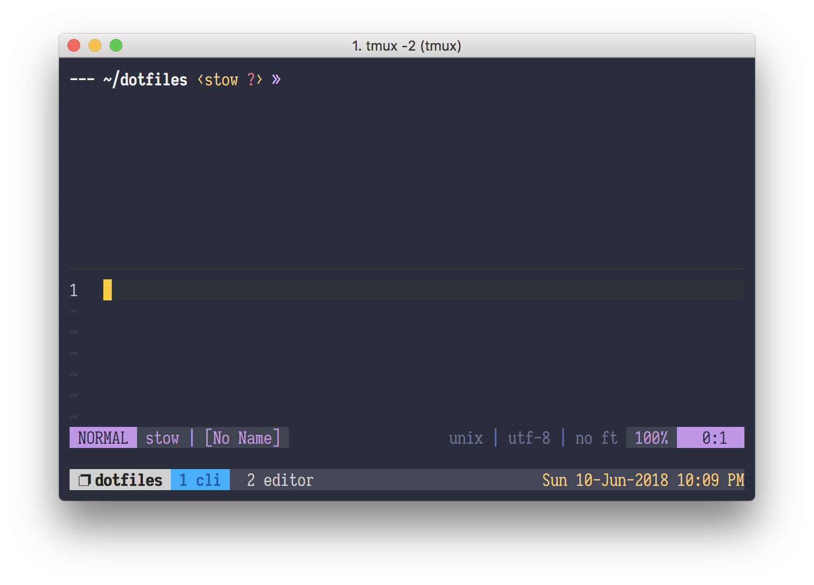

<p align="center">
  
</p>

# dotfiles


### Requirements

- [stow][stow]

Install using Homebrew (macOS)

```sh
brew install stow
```

or using pacman (Arch)

```sh
pacman -S stow
```

### Install

Clone the repository into your `$HOME` directory

```sh
git clone https://github.com/drewtempelmeyer/dotfiles.git ~/dotfiles
```

### Usage

These dotfiles utilize [stow][stow] to make linking configuration directories easy.

To set up the configuration, change into the desired directory (we'll use tmux for this example):

```console
ships@ahoy:~$ cd ~/dotfiles
ships@ahoy:~/dotfiles$ stow tmux
```

#### tmux requirements

When using tmux, [tmux plugin manager](https://github.com/tmux-plugins/tpm) needs to be installed.

You can run the following command to install tpm:

```sh
sh scripts/install-tpm.sh
```

[stow]: https://www.gnu.org/software/stow/